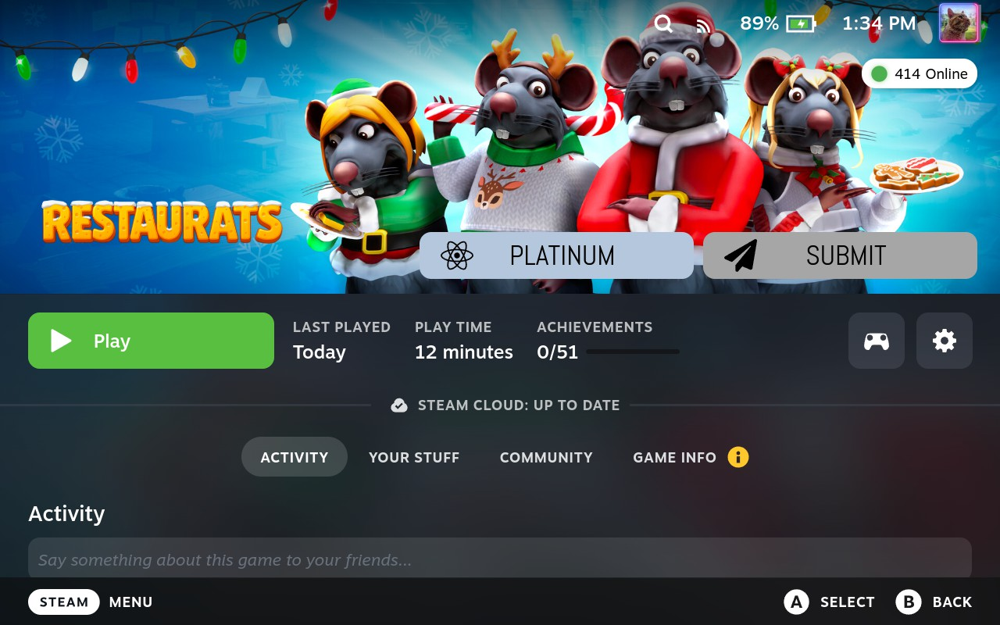
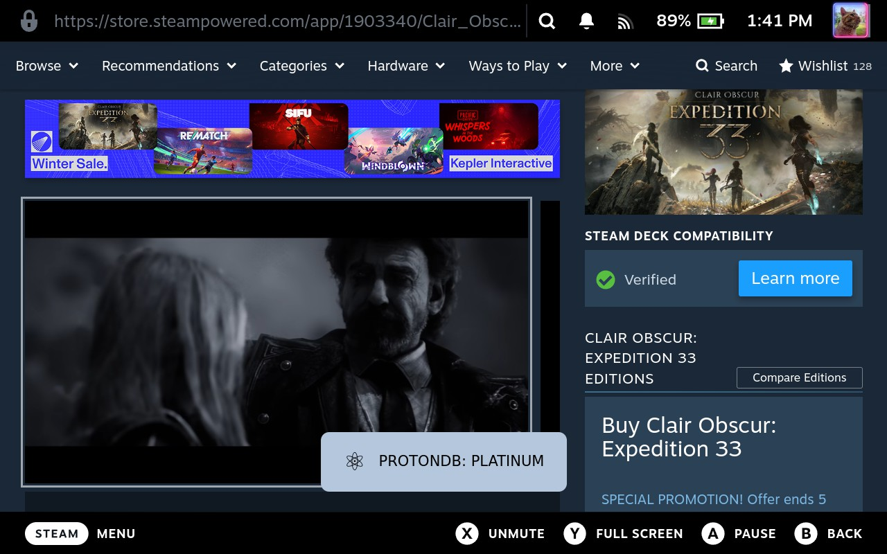

# ProtonDB Badges eXtended 🎮

Display **tappable ProtonDB badges** directly on your Steam library game pages — eXtended edition.
And since version v0.0.5, this also contains a small overlay on the store!

Library view:

Store view:

---

## ⚙️ What it does

ProtonDB Badges eXtended retrieves ProtonDB ratings via the ProtonDB API and overlays them as a tappable badge on each game’s library page. Tapping the badge opens the corresponding ProtonDB page.

This plugin is an actively maintained extension of the original *protondb-decky* plugin and adds a **Submit** button, allowing users to submit ProtonDB reports **directly from Game Mode**, from their library, without opening a browser.  
The submit button can be enabled or disabled in the plugin settings.

---

## ✨ Why this plugin exists

The original protondb-decky plugin is no longer maintained and has been archived. Additionally, submitting ProtonDB reports required several manual steps outside Game Mode.

This plugin was created to:
- Keep ProtonDB badges available on Steam Deck/Steam Client Picture Big mode.
- Simplify report submission.
- Allow submission to be done directly from the game page in Game Mode.
- Show badges on Steam Store page.

---

## 🛠️ Features & Options

- **Badge size**: Regular, Small, or Minimalist (icon-only)
- **Badge position**: Multiple positions around the game header. (Hero)
- **Submit button toggle**: Disable report submission if desired.

---

## ⚠️ Limitations

**ProtonDB device registration**  
The first time you want to submit a report on Steam Deck, you will need to open the protondb website in order to register the Steam Deck.
This is a limitation of the protondb website, and this is only a one-time action.

**Steam Store page badges**  
Currently the badges are visible as an overlay, which doesn't look the same as the badges on the library.

---

## 🌍 Translations

Translations were added or updated using AI, as I don't know yet how Crowdine works.'  
If you spot an incorrect or awkward translation, feedback or pull requests are welcome.

---

## 🧪 Compatibility & Testing

Tested on:
- **SteamOS 3.9** — Steam Deck LCD - Decky Loader v3.2.1 — SteamClient023
- **Ubuntu 25.10** — Steam Big Picture Mode - Decky Loader v3.2.1 — SteamClient023
- **Bazzite 43 (NVIDIA)** - Steam Big Picture Mode - Decky Loader v3.2.1 — SteamClient023

Steam Deck OLED has not been tested yet, because I don't own a Steam Deck OLED. Feel free to send me one.

---

## 💖 Sponsoring

If you find this plugin useful and want to support its continued development, you can sponsor the project.

Your support helps with:
- Maintenance and bug fixes  
- New features and improvements  
- Keeping the plugin free and open-source  

### ❤️ Support the project

- 🐙 **GitHub Sponsors**  
  https://github.com/sponsors/bschelst
- ☕ **Ko-fi**  
  https://ko-fi.com/bschelst
- ☕ **Buy Me a Coffee**  
  https://www.buymeacoffee.com/bschelst

---

## 🧩 Requirements

- Steam Deck or Linux PC using Steam Big Picture
- Decky Loader installed
- Game Mode

Decky Loader:  
https://github.com/SteamDeckHomebrew/decky-loader

---

## 📦 Installation (Decky Loader)

> The plugin is not available in the Decky Store yet and must be installed manually.

1. Download the **latest `.zip` release**:  
   https://github.com/bschelst/protondb-decky-extended/releases

2. Open **Game Mode** and launch **Decky Loader**.

3. Go to **Decky Settings → Plugins → Install from ZIP**.

4. Select the downloaded `protondb-decky-extended-<version>.zip`.

5. Restart steam client.

The badges will appear automatically on supported games in your library.

### 🔄 Updating

To update, install the latest ZIP via Decky Loader.  
Existing settings are preserved.
